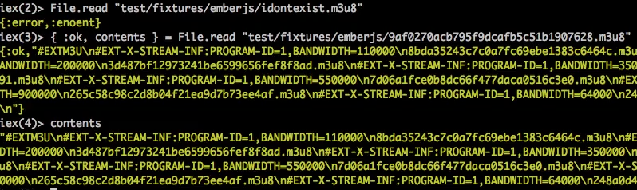

- 
- 
- `defp` means private
- `Enum.find Path.wildcard(files), is_index?(&1)`
- 
- 
```
iex> h Streamers.find_index
iex> Streamers.__info__(:docs)
```
- `if true, do; this, else: that`
- `do end` is syntactic sugar for a block of code. Instead of using paranthesis.
```
iex> <<"jose", x :: binary>> == "jose valim"
"jose valim"
iex> x
" valim"
iex> "jose" <> x = "jose valim" # same as above
```